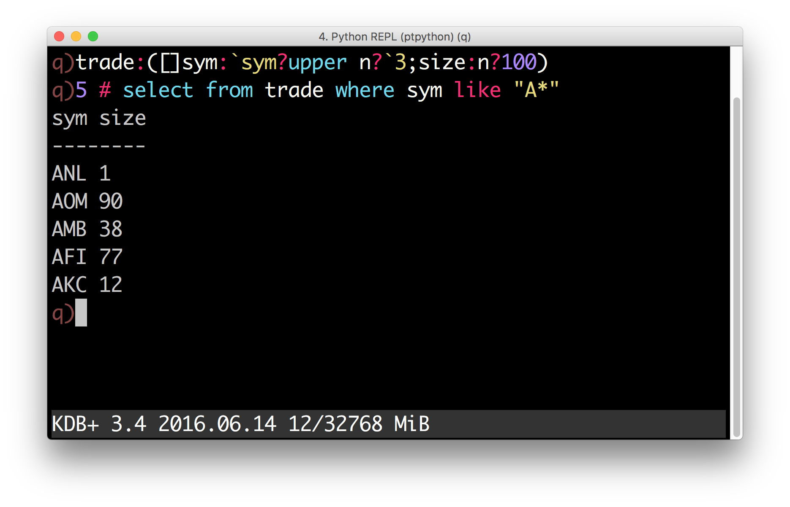

#  What’s new


## Version 4.1

Released 2017.08.30


### Highlights

-   Improved calling Python functions from q:
    -   Objects of any type supported by `K()` can be returned
    -   Python functions can be called from multiple q threads
-   Calls from Python to q will now release GIL allowing concurrent execution of q code from multiple threads
-   Added a backtrace mode (requires kdb+ V3.5+) in which q stack trace is printed on q errors
-   Experimental Windows support
-   Performance improvements


### Return arbitrary objects from Python functions called from q

When a Python function is called from q, the returned Python objects are now automatically converted to q. Any type accepted by the `K()` constructor can be successfully converted. For example, the `numpy.eye` function returns a 2-D array with 1s on the diagonal and 0s elsewhere. It can be called from q as follows:

```q
  q)p)import numpy
  q)p)q.eye = numpy.eye
  q)eye 3 4 1
  0 1 0 0
  0 0 1 0
  0 0 0 1
```


### Calling Python from `peach`

Python functions can now be safely called from multiple q threads. For example, the following session illustrates how `peach` distributes work between four threads:

```bash
$ q -s 4
```

```q
q)p)import threading
q)p)q.tid = threading.get_ident
q){group (distinct x)?x} {tid()} peach til 19
0| 0 4 8 12 16
1| 1 5 9 13 17
2| 2 6 10 14 18
3| 3 7 11 15
```


### Backtrace mode

Backtrace mode is available when PyQ is running under kdb+ V3.5+.

To activate the backtrace mode, set the environment variable `PYQ_BACKTRACE`.

For example:

```bash
$ PYQ_BACKTRACE=yes pyq
```

```python
>>> q('f:{g[]};g:{1+`};f[]')
Traceback (most recent call last):
  ..
_k.error: ('type', k('((({1+`};2);("..g";"";-1;"{1+`}");2;5);(({g[]};2);("..f";"";-1;"{g[]}");1;4);..'))
kdb+ backtrace:
  [5]  g:{1+`}
           ^
  [4]  f:{g[]}
          ^
  [3]  f:{g[]};g:{1+`};f[]
                       ^
  ..
```


### Experimental Windows support

PyQ can now be installed on Windows. We tested PyQ 4.1.0 with Python 3.6 build using VS 2015 and 2017 and 32-bit kdb+ 3.5.

PyQ 4.1.1 adds support for Python 2.7.x with [Microsoft Visual C++ Compiler for Python 2.7](http://aka.ms/vcpython27).

Latest updates on Windows support, as well as latest patches can be found at [Github](https://github.com/kxsystems/pyq/issues/1).


## Version 4.0

Released 2017.03.02


### Highlights

-   Enhanced q) prompt with syntax highlighting
-   New operators: `<<`, `>>` and `@`
-   Improved means for constructing `K` objects of arbitrary types
-   Type casts using attribute syntax
-   Improved numpy interoperability
-   Restored support for KDB+ 2.x
-   Better documentation
-   More `k.h` functions are exposed to Python internally
-   Added convenience scripts for starting different interactive sessions
-   Additional conversions between ~pyq.K and native Python objects
-   Redesigned adverbs


### Enhanced `q)` prompt

The `q)` prompt will now use the prompt toolkit when available to provide a separate command history, q syntax highlighting and a status bar displaying system information.




### New operators

Three new operators are defined for `K` objects: `<<`, `>>` and `@`.


#### Shift operators

Shift operators `<<` and `>>` can now be used to shift elements in `K` lists:
```python
>>> q.til(10) << 3
k('3 4 5 6 7 8 9 0N 0N 0N')
>>> q.til(10) >> 3
k('0N 0N 0N 0 1 2 3 4 5 6')
```


### The `@` operator

Users of Python 3.5 or later can now use the new binary operator `@` to call q functions without using parentheses:

```python
>>> q.til @ 5
k('0 1 2 3 4')
```
The same operator between two functions creates a function composition. For example, the dot product can be defined succinctly as
```python
>>> dot = q.sum @ q('*')
>>> dot([1, 2, 3], [3, 2, 1])
k('10')
```


### Typed constructors and casts

Atoms and lists of like atoms can now be constructed from Python objects using typed constructors. For example, by default, a list of strings passed to the default `K` constructor becomes a symbol list:

```python
>>> colors = K(['white', 'blue', 'red']) 
>>> colors k('`white`blue`red')
```

If you want to create a list of strings, you can use a typed constructor:

```python
>>> K.string(["Donald E. Knuth", "Edsger W. Dijkstra"])
k('("Donald E. Knuth";"Edsger W. Dijkstra")')
```

If you already have a symbol list and want to convert it to strings, you can use the attribute-access notation to perform the cast:

```python
>>> colors.string
k('("white";"blue";"red")')
```

Similar operations can be performed with numeric data. For example, to create a matrix of single-precision floats (real), call

```python
>>> m = K.real([[1, 0, 0], 
...             [0, 1, 0], 
...             [0, 0, 1]])
>>> m
k('(1 0 0e;0 1 0e;0 0 1e)')
```

To cast the result to booleans — access the `K`.boolean attribute:

```python
>>> m.boolean.show()
100b 010b 001b
```

Unlike q, Python does not have special syntax for missing values and infinities. Those values can now be created in PyQ by accessing `na` and `inf` attributes on the typed constructors:

```python
>>> for x in [K.int, K.float, K.date, K.timespan]: 
...     print(x.na, x.inf)
0Ni 0Wi 
0n 0w 
0Nd 0Wd 
0Nn 0Wn
```


### Interoperability with NumPy

#### Matrices and arrays of higher dimensions

Arrays with `ndim > 1` can now be passed to `q` and they become nested lists. For example:

```python
>>> q.x = numpy.arange(12, dtype=float).reshape((2, 3, 2))
>>> q.x
k('((0 1f;2 3f;4 5f);(6 7f;8 9f;10 11f))')
```

Similarly, `ndim > 1` arrays can be constructed from lists of regular shape:

```python
>>> numpy.array(q.x)
array([[[ 0., 1.], 
        [ 2., 3.], 
        [ 4., 5.]], 

      [[  6., 7.], 
       [  8., 9.], 
       [ 10., 11.]]])
```


### Times, dates and timedeltas

Prior to 4.0, conversion of temporal data to NumPy arrays would expose internal integer values. For example, a list of months

```python
>>>months = q('2001.01m + til 3')
```

would become an integer array when converted to NumPy:

```python
>>> numpy.array(months).tolist()
[12, 13, 14]
```

Now, an array of type datetime64 is returned:

```python
>>> numpy.array(months)
 array(['2001-01', '2001-02', '2001-03'], dtype='datetime64[M]')
```

Note that the resulting array has different numeric values and cannot share the data with the `K` object. To share the data and/or to get an array as in older versions, one should use the new `data` attribute:

```python
>>> a = numpy.asarray(months.data) 
>>> a.tolist()
[12, 13, 14]
```

An array constructed from the `data` attribute will use the same underlying storage. This means that changing the array will change the `K` object.

```python
>>> a[:] += 998*12
>>> months
k('2999.01 2999.02 2999.03m')
```


### Additional conversions

#### Complex numbers

Complex numbers can now be passed to and obtained from kdb+. When passed to kdb+, complex numbers are automatically converted to dictionaries with keys `re` and `im` and lists of complex numbers are converted to tables with columns `re` and `im`.

```python
>>> q.z = [1 + 2j, 3 + 4j, 5 + 6j] 
>>> q.z.show() 
re im 
-----
1 2 
3 4 
5 6 
>>> [complex(x) for x in q.z]
[(1+2j), (3+4j), (5+6j)]
```


#### Path objects

`Path` objects can now be used where q path handle symbols are expected

```python
>>> import pathlib 
>>> path = pathlib.Path('xyz')
>>> q.set(path, 42) 
k(':xyz')
>>> q.get(path)
k('42')
>>> path.unlink()
```


#### Named tuples

Named tuples are now converted to dictionaries:

```python
>>> from collections import namedtuple
>>> Point = namedtuple('Point', 'x,y')
>>> q.point = Point(1, 2)
>>> q.point
k('`x`y!1 2')
```

As a consequence, a uniform list of named tuples is converted to a table:

```python
>>> q.points = [Point(1, 2), Point(3, 4), Point(5, 6)] 
>>> q.points.show() 
x y 
---
1 2 
3 4 
5 6
```


### Redesigned iterators

Iterators (formerly _adverbs_) can now be used on functions with different ranks. For example, `scan` and `over` can be used with unary functions. To illustrate, the following code generates a Pascal triangle:

```python
>>> f = q('{(0,x)+x,0}') 
>>> f.scan(6, 1).show()
1 
1 1 
1 2 1 
1 3 3 1 
1 4 6 4 1 
1 5 10 10 5 1 
1 6 15 20 15 6 1
```

If only the last row is of interest – use `over`:

```python
>>> f.over(6, 1)
k('1 6 15 20 15 6 1')
```


